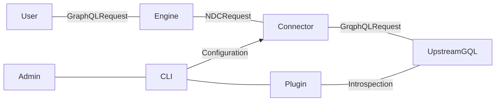

# Hasura GraphQL Connector

<a href="https://hasura.io/"></a>

[](https://hasura.io/docs/3.0/connectors/postgresql)
[](https://github.com/hasura/ndc-graphql/releases/latest)
[](LICENSE.txt)
[](https://hasura.io/connectors/graphql)

The Hasura GraphQL Connector allows for connecting to a GraphQL API and bringing it into Hasura DDN supergraph as a single unified API. It can also be used to bring in your current Hasura v2 graphQL API into Hasura DDN and our recommended approach is to create a new subgraph for the v2 API.

For Hasura v2 users, this functionality is the replacement of [remote schemas](https://hasura.io/docs/latest/remote-schemas/overview/) functionality in v3 (DDN).

This connector is built using the [Rust Native Data Connector SDK](https://github.com/hasura/ndc-hub#rusk-sdk) and implements the [Native Data Connector Spec](https://github.com/hasura/ndc-spec).

The connector translates the root-fields of a GraphQL schema to NDC [functions](https://hasura.github.io/ndc-spec/specification/schema/functions.html) and [procedures](https://hasura.github.io/ndc-spec/specification/schema/procedures.html). This results in your GraphQL root-fields being exposed as [commands](https://hasura.io/docs/3.0/supergraph-modeling/commands) in the Hasura supergraph. This simplifies implementation and acts as a proxy more than a [model](https://hasura.io/docs/3.0/supergraph-modeling/models).

The recent support for field arguments and header forwarding on [Hasura v3 engine](https://github.com/hasura/graphql-engine/tree/master/v3) allow the connector to represent the majority of queries and mutations.



The connector is configured in plugin mode, then run in execution mode.

Header forwarding is implemented as additional command arguments and wired
from headers to the argument by the engine via [the new `ArgumentPresets` feature](https://hasura.io/docs/3.0/supergraph-modeling/permissions/#modelpermissions-argumentpreset).

- [Connector information in the Hasura Hub](https://hasura.io/connectors/graphql)
- [Hasura V3 Documentation](https://hasura.io/docs/3.0)

## Features

Below, you'll find a matrix of all supported features for the PostgreSQL connector:

| Feature                | Supported | Notes |
| ---------------------- | --------- | ----- |
| Queries                | ✅        | All features that v3 engine currently supports
| Mutations              | ✅        |
| Header Passthrough     | ✅        | Entire headers can be forwarded
| Subscriptions          | ❌        |
| Unions                 | ❌        | Can be brought in via scalar types
| Interfaces             | ❌        |
| Relay API              | ❌        |
| Directives             | ❌        | @cached, Apollo directives

#### Other Considerations and limitations

* The V2 and V3 projects must share an auth provider in order to support JWT query authorization
  - Either pre-shared credentials, or shared auth providers are supported
  - Seperate providers for engine and upstream are not currently supported
* Error formatting
  - The format of errors from the connector does not currently match V2 error formatting
  - No "partial error" or "multiple errors" responses
* `_headers` argument needs to be removed from commands by hand
    - This should not be required when it is provided by argument presets
  - This is a bug which will be addressed in future
* Role based schemas
  - Only a single schema is supported. 
  - We recommend creating different subgraphs for different roles.
* Pulling items out of session - Currently no session parsing and refined mappings are supported
* Pattern matching in request header forwarding configuration
  - This uses simple glob patterns
  - More advanced matching and extraction is not currently supported
* Response headers only allow at most one header per name
  - For example you may only use one `Set-Cookie` response header

## Before you get Started

[Prerequisites or recommended steps before using the connector.]

1. The [DDN CLI](https://hasura.io/docs/3.0/cli/installation) and [Docker](https://docs.docker.com/engine/install/) installed
2. A [supergraph](https://hasura.io/docs/3.0/getting-started/init-supergraph)
3. A [subgraph](https://hasura.io/docs/3.0/getting-started/init-subgraph)
<!-- TODO: add anything connector-specific here -->

The steps below explain how to Initialize and configure a connector for local development. You can learn how to deploy a connector — after it's been configured — [here](https://hasura.io/docs/3.0/getting-started/deployment/deploy-a-connector).


## Using the GraphQL Connector

The high-level steps for working with the GraphQL connector follows
the same pattern as any connector:

* Add the connector
* Configure the connector
* Integrate into your supergraph
* Configure in your supergraph

The main focus with respect to the GraphQL connector will be:

* Configuring the introspection role
* Configuring the header passthrough behaviour
* Configuring the argument preset and response header behaviour in the connector link
* Replicating specific permissions in models

### Authenticate your CLI session

```bash
ddn auth login
```

### Add the connector

The connector has been designed to work best in its own subgraph. While it is possible to
use in an existing subgraph, we recommend [creating a subgraph](https://hasura.io/docs/3.0/getting-started/init-subgraph)for the purposes of connecting to a GraphQL schema with this connector.
Once you are operating within a subgraph you can add the GraphQL connector:

```sh
ddn subgraph init app --dir app --target-supergraph supergraph.local.yaml --target-supergraph supergraph.cloud.yaml
ddn connector init graphql --subgraph ./app/subgraph.yaml --add-to-compose-file compose.yaml --configure-port 8081 --hub-connector hasura/graphql
```

<details>
<summary>An example of a full connector configuration.</summary>

```json
{
  "$schema": "configuration.schema.json",
  "execution": {
    "endpoint": {
      "value": "https://my-app.hasura.app/v1/graphql"
    },
    "headers": {
      "Content-Type": {
        "value": "application/json"
      }
    }
  },
  "introspection": {
    "endpoint": {
      "value": "https://my-app.hasura.app/v1/graphql"
    },
    "headers": {
      "X-Hasura-Admin-Secret": {
        "value": "hunter2"
      },
      "Content-Type": {
        "value": "application/json"
      }
    }
  },
  "request": {
    "headersArgument": "_headers",
    "forwardHeaders": [
      "Authorization"
    ]
  },
  "response": {}
}
```
</details>

**Note: Any literal `"value"` in the configuration can be replaced with `"valueFromEnv"` in order to read from environments.**


### Configuring the introspection role

Once the connector has been added it will expose its configuration in
`config/configuration.json`. You should update some values in this config before
performing introspection.

The configuration is split into request/connection/introspection sections.
You should update the introspection of the configuration to have the
`x-hasura-admin-secret` and `x-hasura-role` headers set in order to allow
the introspection request to be executed.

You may wish to provide a pre-baked value for `x-hasura-role` if you want
to have introspection occur as the desired role, or more interestingly,
if you wish to have requests execute under a role with no forwarded
auth credentials required.

```json
{
  ...
  "introspection": {
    "endpoint": {
      "value": "https://my-hasura-v2-service/v1/graphql"
    },
    "headers": {
      "X-Hasura-Admin-Secret": {
        "value": "my-super-secret-admin-secret"
      },
      "Content-Type": {
        "value": "application/json"
      }
    }
  }
}
```

Without an explicit role set this will use the admin role to fetch the schema, which may or may not be appropriate for your application!

### Configuring the Execution Role

You may also configure the connector for execution (i.e. GraphQL request) time behaviour.
This could include pointing to a different instance, forwarding different headers,
returning different response headers, etc.

You may also set the headers argument name, which by default will be `_headers`.

```json
{
  ...
  "execution": {
    "endpoint": {
      "value": "https://my-hasura-v2-service/v1/graphql"
    },
    "headers": {
      "Content-Type": {
        "value": "application/json"
      }
    }
  },
  "request": {
    "headersArgument": "_headers",
    "forwardHeaders": [ "Authorization" ]
  }
}
```

### Performing Introspection

Once the connector introspection configuration is updated, you can perform an update
in order to fetch the schema for use and then add the connector link:

```sh
ddn connector introspect --connector ./app/connector/graphql/connector.local.yaml
ddn connector-link add graphql --configure-host http://local.hasura.dev:8081 --subgraph app/subgraph.yaml --target-env-file app/.env.app.local
```

At this point you will want to have your connector running locally if you are performing local development:

```sh
docker compose up -d --build app_graphql
```


### Configuring the header passthrough behaviour

The connector link will probably need to be updated to pass through headers.

This is done with the following metadata configuration:

```yaml
kind: DataConnectorLink
version: v1
definition:
  name: graphql
  url:
    readWriteUrls:
      read:
        valueFromEnv: APP_GRAPHQL_READ_URL
      write:
        valueFromEnv: APP_GRAPHQL_WRITE_URL
  schema:
    # This is read from the connector schema configuration
  argumentPresets:
    - argument: headers
      value:
        httpHeaders:
          forward:
            - X-Hasura-Admin-Secret
            - Authorization
          additional: {}
```

You may also want to configuring the response header behaviour at this point if you
need to have response headers passed back to the client.

If the connector is "pre-baked" in that it does not require any request credentials
to use, then you may omit the header forwarding entirely. This may be appropriate
if there is a public readonly instance of Hasura available for use.


### Integrate into your supergraph

Track the associated commands (functions/procedures) in your supergraph:

```sh
ddn connector-link update graphql --subgraph app/subgraph.yaml --env-file app/.env.app.local --add-all-resources
```

If you just need to update your existing connector you can run the update command again.

This will add/update the commands defined in the subgraph metadata defined in `metadata/graphql/commands`. Currently you will want to remove the `headers` argument defined in these commands
as this will be supplied automatically by the argument presets.

An example of a generated command metadata snippet:

```yaml
---
kind: Command
version: v1
definition:
  name: Child
  outputType: ChildQueryResponse!
  arguments:
    - name: headers # REMOVE
      type: HeaderMap! # REMOVE
    - name: distinctOn
      type: "[ChildSelectColumn!]"
      description: distinct select on columns
    - name: limit
      type: Int
      description: limit the number of rows returned
    - name: offset
      type: Int
      description: skip the first n rows. Use only with order_by
    - name: orderBy
      type: "[ChildOrderBy!]"
      description: sort the rows by one or more columns
    - name: where
      type: ChildBoolExp
      description: filter the rows returned
  source:
    dataConnectorName: graphql
    dataConnectorCommand:
      function: child
    argumentMapping:
      headers: _headers # REMOVE
      distinctOn: distinct_on
      limit: limit
      offset: offset
      orderBy: order_by
      where: where
  graphql:
    rootFieldName: app_child
    rootFieldKind: Query
  description: 'fetch data from the table: "child"'
```

**Note: You will currently need to remove the references to the header argument
      if it is being included through the argument presets feature!
      See the `# REMOVE` comments. You will encounter a build error if you
      forget to do this.**

### Testing your Supergraph

You can then build and test your supergraph:

```sh
ddn supergraph build local --supergraph supergraph.local.yaml --output-dir engine --subgraph-env-file=app:./app/.env.app.local
```

See your docker compose file for information on exposed service ports.


### Replicating specific permissions in models

While this may be sufficient if your schema and role matches,
if you wish to have additionally restrictive permissions imposed you may
do so at the model level with [the Hasura V3 permissions system](https://hasura.io/docs/3.0/supergraph-modeling/permissions).


### Removing namespacing

While integrating the connector may be sufficient for building new applications,
if you wish to preserve API behaviour for existing V2 applications you may wish
to alther the subgraph namspacing configuration in order to return the API
the one that matches the original upstream GraphQL source.

You can remove the namespace for a subgraph as per the following example
of a supergraph configuratgion metadata:

```yaml
kind: Supergraph
version: v1
definition:
  project: 
  supergraph_globals:
    generator:
      rootPath: ./supergraph
    envFile: ./supergraph/.env.supergraph
    includePaths:
      - ./supergraph/auth-config.hml
      - ./supergraph/compatibility-config.hml
      - ./supergraph/graphql-config.hml
  subgraphs:
    app:
      generator:
        rootPath: app/metadata
      envFile: app/.env.app
      namingConvention: "no-mod"
      includePaths:
        - app
```

Note the `namingConvention` field!


## Schemas

One limitation of the current state of the connector is that it can only serve
a single schema. While requests can adopt any role that the auth behaviour of
the V2 instance (provided the same JWT auth provider is used) if the schema
changes per-role then this won't be reflected in the Hasura engine's schema
without additional permissions being configured.

As such the current recommended pattern is to select a single "application user"
schema to use for your application and perform the connector configuration
introspection using this user role.

If admin or additional roles are required for non application use then this can be
done directly with the V2 instance without having to expose it via the connector.

Additional application roles can be added via multiple instances of the connector
with different roles used for introspection, however this has the limitation of
requiring distinct namespaces which may not be ideal.

Finally if you need to share a namespace but have different roles you can currently
just expose the admin schema and have each role connect and issue their requests
with the correct role with permissions enforced correctly at runtime, but the 
schema not reflecting the correct restrictive permissions at development time.

In future we wish to be able to replicate the correct permissions in the engine
assisted by tooling which will resolve these issues.

See the [Removing namespacing](#removing-namespacing) section for more details
on removing default namespacing for fields and types.

## Authorization Use-Cases

There are several ways we anticipate users may wish to integrate upstream GraphQL schemas.


### Admin secret mode

Since arbitrary headers can be configured as presets in the connector, you may choose
to set the admin-secret or pre-shared key. This will allow the engine to make upstream
requests via the connector without having to deal with any user-level auth concerns.

This may be useful for prototyping or development, but it is dangerous for several reasons:

* Credentials for the V2 instance need to be saved
* The V2 instance acts on behalf of the configured user instead of the application user
* Auditing requests may be more difficult
* Requests may inadvertantly or deliberately interact with data that the application user
  should not be able to access or modify


### Shared JWT provider mode

This is the recommended execution mode.

The JWT provider / authenticator is shared between the V2 and V3 instance and as such
all requests are able to be understood sematically by both instances. While
permissions can be configured explicitly in V3, they will automatically also be enforced
by the V2 instance as per its configuration.

One consideration to make here is that the JWT TTL slack should take into account execution
time in case a request times out after receipt by V3 engine but before receipt from
the V2 instance.

If the `exp` JWT claim and client behaviour are not set up to ensure that this scenario
doesn't occur then you *could* use `ClockSkew` configuration in order to account for the
latency between the V3 and V2 instances.


### Independent auth scenario

Users may with to have seperate providers for V3 Engine and V2 Upstream source.

This is not currently supported, however, we would like to add support for this in future.
