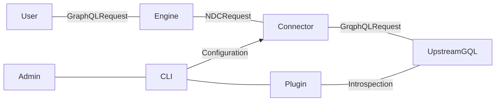

# GraphQL Native Data Connector for Hasura DDN

This GraphQL connector is intended to provide support for integrating Hasura V2
projects into Hasura V3 projects as subgraphs. In addition to this immediate
feature, the connector can connect many other GraphQL schemas similar to the
"Remote Schema" feature in Hasura V2.

This is implemented by providing a connector that translates the root-fields
of a GraphQL schema to NDC commands (function/procedures). Recent support for
field arguments and header forwarding allow the connector to represent the
majority of V2 queries/mutations.

**Current Limitations Include**

* Support for interfaces and unions is not currently available so schemas using
  these features are not fully supported
* The V2 and V3 projects must share an auth provider in order to support JWT query authorization
* Errors returned by the connector will be formatted differently

## Usage

The high-level steps for working with the GraphQL connector follows
the same pattern as any connector:

* Add the connector
* Configure the connector
* Integrate into your supergraph
* Configure in your supergraph

The main focus wrt. the GraphQL connector will be:

* Configuring the introspection role
* Configuring the header passthrough behaviour
* Configuring the argument preset and response header behaviour in the connector link
* Replicating specific permissions in models

All of the following steps assume you are working within an existing Hasura V3 project.
Please see [the V3 documentation](https://hasura.io/docs/3.0/getting-started/init-subgraph) for
information about getting started with Hasura V3.

Likewise, when using the connector to connect to a Hasura V2 project, you can see the
[V2 documentation](https://hasura.io/docs/latest/index/) for information about Hasura V2.

### Add the connector

The connector has been designed to work best in its own subgraph. While it is possible to
use in an existing subgraph, we recommend [creating a subgraph](https://hasura.io/docs/3.0/getting-started/init-subgraph)
for the purposes of connecting to a GraphQL schema with this connector.
Once you are operating within a subgraph you can add the GraphQL connector:

```sh
ddn subgraph init app
cd app
ddn connector init graphql --hub-connector hasura/graphql
```


### Configuring the introspection role

Once the connector has been added it will expose its configuration in
`config/configuration.json`. You should update some values in this config before
performing introspection.

The configuration Is split into request/connection/introspection sections.
You should update the introspection of the configuration to have the
`x-hasura-admin-secret` and `x-hasura-role` headers set in order to allow
the introspection request to be executed.

```json
{
  ...
  "introspection": {
    "endpoint": {
      "value": "https://my-hasura-v2-service/v1/graphql"
    },
    "headers": {
      "X-Hasura-Admin-Secret": {
        "value": "my-super-secret-admin-secret"
      },
      "Content-Type": {
        "value": "application/json"
      }
    }
  }
}
```

Without an explicit role set this will use the admin role to fetch the schema, which
may or may not be appropriate for your application!

### Performing Introspection

Once the connector introspection configuration is updated, you can perform an update
in order to fetch the schema for use and then add the connector link:

```sh
# Benoit?
ddn connector introspect
ddn connector-link update graphql --add-all-resources
```

### Configuring the header passthrough behaviour

The connector link will probably need to be updated to pass through headers.

This is done with the following metadata configuration:

```yaml
kind: DataConnectorLink
version: v1
definition:
  name: graphql
  url:
    readWriteUrls:
      read:
        valueFromEnv: APP_GRAPHQL_READ_URL
      write:
        valueFromEnv: APP_GRAPHQL_WRITE_URL
  schema:
    # This is read from the connector schema configuration
  argumentPresets:
    - argument: headers
      value:
        httpHeaders:
          forward:
            - X-Hasura-Admin-Secret
            - Authorization
          additional: {}
```

You may also want to configuring the response header behaviour at this point if you
need to have response headers passed back to the client.

### Integrate into your supergraph

Track the associated commands (functions/procedures) in your supergraph:

```sh
# Benoit?
ddn-staging connector-link update graphql --add-all-resources
```

### Replicating specific permissions in models

While this may be sufficient if your schema and role matches,
if you wish to have additionally restrictive permissions imposed you may
do so at the model level with [the Hasura V3 permissions system](https://hasura.io/docs/3.0/supergraph-modeling/permissions).

### Removing namespacing

While integrating the connector may be sufficient for building new applications,
if you wish to preserve API behaviour for existing V2 applications you may wish
to alther the subgraph namspacing configuration in order to return the API
the one that matches the original upstream GraphQL source.

TODO: See docs.

## Execution



The connector is configured in plugin mode, then run in execution mode.

Requests are made via NDC commands to the connector rather than collections.
This simplifies implementation and acts as a proxy more than a model.
Field Arguments are leveraged in commands to allow mirroring the GraphQL queries
executed by the user.

Header forwarding is implemented as additional command arguments and wired
from headers to the argument by the engine via the new `ArgumentPresets`
feature.

TODO: Link docs.

## Schemas

One limitation of the current state of the connector is that it can only serve
a single schema. While requests can adopt any role that the auth behaviour of
the V2 instance (provided the same JWT auth provider is used) if the schema
changes per-role then this won't be reflected in the Hasura engine's schema
without additional permissions being configured.

As such the current recommended pattern is to select a single "application user"
schema to use for your application and perform the connector configuration
introspection using this user role.

If admin or additional roles are required for non application use then this can be
done directly with the V2 instance without having to expose it via the connector.

Additional application roles can be added via multiple instances of the connector
with different roles used for introspection, however this has the limitation of
requiring distinct namespaces which may not be ideal.

Finally if you need to share a namespace but have different roles you can currently
just expose the admin schema and have each role connect and issue their requests
with the correct role with permissions enforced correctly at runtime, but the 
schema not reflecting the correct restrictive permissions at development time.

In future we wish to be able to replicate the correct permissions in the engine
assisted by tooling which will resolve these issues.

## Authorization Use-Cases

There are several ways we anticipate users may wish to integrate upstream GraphQL schemas.

### Admin secret mode

Since arbitrary headers can be configured as presets in the connector, you may choose
to set the admin-secret or pre-shared key. This will allow the engine to make upstream
requests via the connector without having to deal with any user-level auth concerns.

This may be useful for prototyping or development, but it is dangerous for several reasons:

* Credentials for the V2 instance need to be saved
* The V2 instance acts on behalf of the configured user instead of the application user
* Auditing requests may be more difficult
* Requests may inadvertantly or deliberately interact with data that the application user
  should not be able to access or modify

### Shared JWT provider mode

This is the recommended execution mode.

The JWT provider / authenticator is shared between the V2 and V3 instance and as such
all requests are able to be understood sematically by both instances. While
permissions can be configured explicitly in V3, they will automatically also be enforced
by the V2 instance as per its configuration.

One consideration to make here is that the JWT TTL slack should take into account execution
time in case a request times out after receipt by V3 engine but before receipt from
the V2 instance.

TODO: See JWT TTL slack docs.

### Independent auth scenario

Users may with to have seperate providers for V3 Engine and V2 Upstream source.

This is not currently supported, however, we would like to add support for this in future.

## Limitations

Here is a summary of the known limitations of the connector

* Response headers only allow at most one header per name
  - For example you may only use one `Set-Cookie` response header
* Pattern matching in request header forwarding configuration
  - This uses simple glob patterns
  - More advanced matching and extraction is not currently supported
* Pulling items out of session
  - Entire headers can be forwarded
  - Currently no session parsing and refined mappings are supported
* Seperate auth providers
  - Either pre-shared credentials, or shared auth providers are supported
  - Seperate providers for engine and upstream are not currently supported
* Role based schemas
  - Only a single schema is supported
* Error formatting
  - The format of errors from the connector does not currently match V2 error formatting
  - No "partial error" or "multiple errors" responses

## Development

TODO: Benoit? Do we have a new refresh.sh? Should we even document this here?

* Running the connector with Docker compose loop
* Provided resources
* `refresh.sh` script