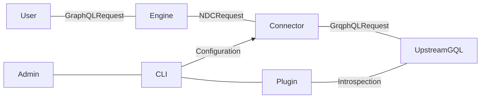

# Hasura GraphQL Connector

<a href="https://hasura.io/"></a>

[](https://hasura.io/docs/3.0/connectors/postgresql)
[](https://github.com/hasura/ndc-graphql/releases/latest)
[](LICENSE.txt)
[](https://hasura.io/connectors/graphql)

The Hasura GraphQL Connector allows for connecting to a GraphQL API and bringing it into Hasura DDN supergraph as a single unified API. It can also be used to bring in your current Hasura v2 graphQL API into Hasura DDN and our recommended approach is to create a new subgraph for the v2 API.

For Hasura v2 users, this functionality is the replacement of [remote schemas](https://hasura.io/docs/latest/remote-schemas/overview/) functionality in v3 (DDN).

This connector is built using the [Rust Native Data Connector SDK](https://github.com/hasura/ndc-hub#rusk-sdk) and implements the [Native Data Connector Spec](https://github.com/hasura/ndc-spec).

The connector translates the root-fields of a GraphQL schema to NDC [functions](https://hasura.github.io/ndc-spec/specification/schema/functions.html) and [procedures](https://hasura.github.io/ndc-spec/specification/schema/procedures.html). This results in your GraphQL root-fields being exposed as [commands](https://hasura.io/docs/3.0/supergraph-modeling/commands) in the Hasura supergraph. This simplifies implementation and acts as a proxy more than a [model](https://hasura.io/docs/3.0/supergraph-modeling/models).

The recent support for field arguments and header forwarding on [Hasura v3 engine](https://github.com/hasura/graphql-engine/tree/master/v3) allow the connector to represent the majority of queries and mutations.



The connector is configured in plugin mode, then run in execution mode.

Header forwarding is implemented as additional command arguments and wired
from headers to the argument by the engine via [the new `ArgumentPresets` feature](https://hasura.io/docs/3.0/supergraph-modeling/permissions/#modelpermissions-argumentpreset).

- [Connector information in the Hasura Hub](https://hasura.io/connectors/graphql)
- [Hasura V3 Documentation](https://hasura.io/docs/3.0)

## Features

Below, you'll find a matrix of all supported features for the GraphQL connector:

| Feature                 | Supported | Notes                                                        |
| ----------------------- | --------- | ------------------------------------------------------------ |
| Queries                 | ✅         | All features that v3 engine currently supports               |
| Mutations               | ✅         |                                                              |
| Header Passthrough      | ✅         | Entire headers can be forwarded                              |
| Request-level Arguments | ✅         | Support dynamic headers from the from Pre-NDC Request Plugin |
| Subscriptions           | ❌         |                                                              |
| Unions                  | ❌         | Can be brought in via scalar types                           |
| Interfaces              | ❌         |                                                              |
| Relay API               | ❌         |                                                              |
| Directives              | ❌         | @cached, Apollo directives                                   |

## Other Considerations and limitations

* Error formatting
  - The format of errors from the connector does not currently match V2 error formatting
  - No "partial error" or "multiple errors" responses
* Pattern matching in request header forwarding configuration
  - This uses simple glob patterns
  - More advanced matching and extraction is not currently supported
* Response headers only allow at most one header per name
  - For example you may only use one `Set-Cookie` response header

## Using the GraphQL Connector

This connector should be used with Hasura DDN.
Please see the [relevant documentation](https://hasura.info/graphql-getting-started).

## Advanced Features

### Forward Headers from Pre-NDC Request Plugin
 
You can use a [Pre-NDC Request Plugin](https://hasura.io/docs/3.0/plugins/introduction#pre-ndc-request-plugin) to modify the request, and add dynamic headers in runtime via `request_arguments.headers` field, which is a string map. Those headers will be merged into the HTTP request headers before being sent to external services.

> See the full example at [Pre-NDC Request Plugin Request](https://hasura.io/docs/3.0/plugins/introduction#example-configuration)
 
```json
{
  // ...
  "ndcRequest": {
    // ...
    "request_arguments": {
        "headers": {
            "Authorization": "Bearer <token>",
            "X-Custom-Header": "foo"
        }
    }
  }
}
```